Recorriendo la [Brevet 300 hacia la Central Rapel](/posts/brevet/brevet_300_rapel), en el poblado de **Loica**, comuna de San Pedro, encontré una iglesia abandonada! Para cruzar a ella había que pasar por un puente metálico. 

::: {.foto .centrar}
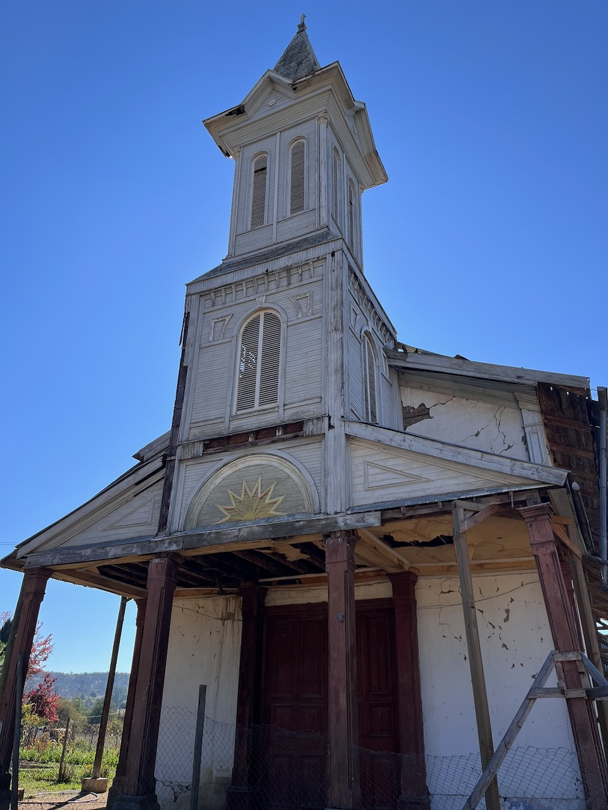{.lightbox}
:::

La iglesia se veía en mal estado de conservación por fuera, con una reja para impedir el paso directo. Pero esto no me impidió acercarme a explorarla!


::: {.mapa}
```{r}
#| cache: true

library(mapgl)
library(sf)

coordenadas <- c(-71.48135, -33.96850)

punto <- coordenadas |> 
  st_point() |> 
  st_sfc(crs = 4326)

maplibre(
  style = carto_style("dark-matter"),
  center = coordenadas,
  zoom = 13,
  tilt = 30,
  attribution_control = FALSE
) |>
  add_markers(data = punto,
              color = "#DD2694")
```
:::

La iglesia tenía una torre de madera preciosa, con un detalle en forma de sol amarillo al frente, y un portón de madera cerrado con candado.

::: {.galeria}
{.fotito .lightbox group="Afuera"}
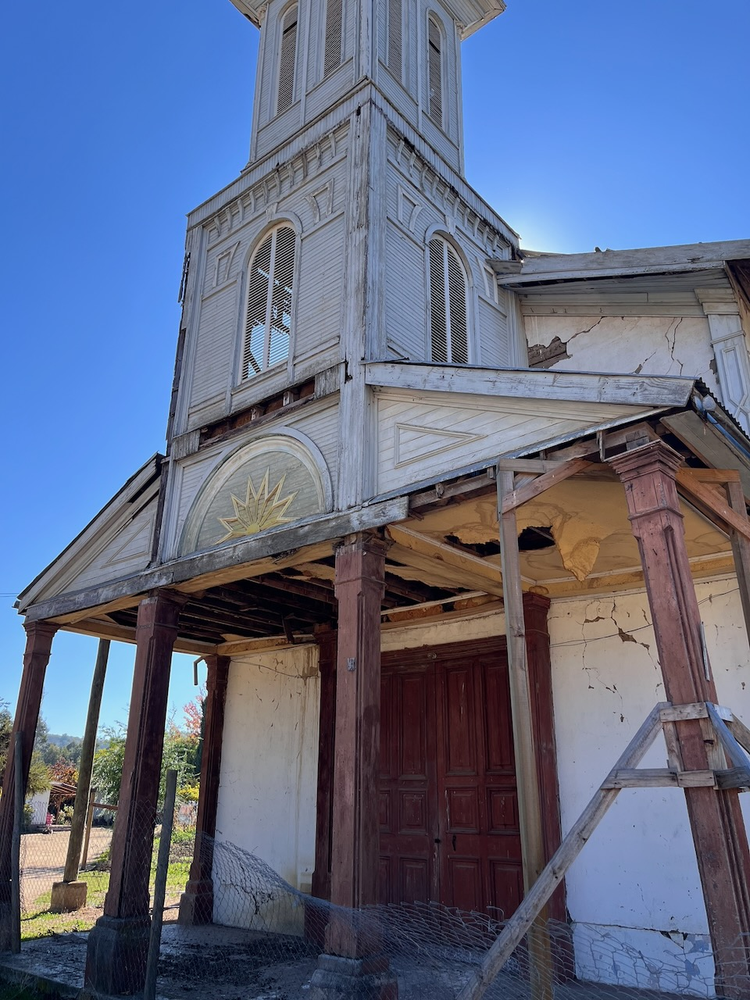{.fotito .lightbox group="Afuera"}
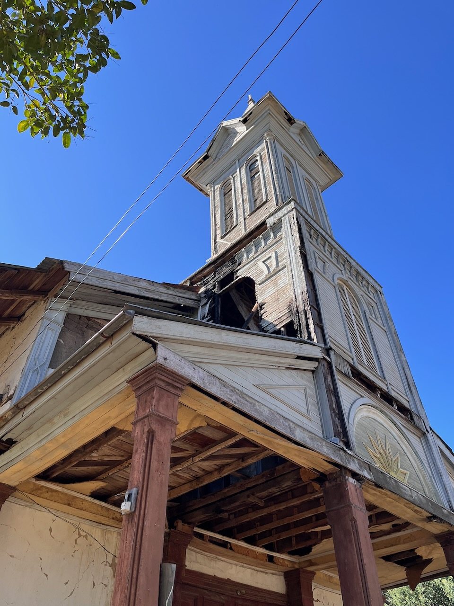{.fotito .lightbox group="Afuera"}
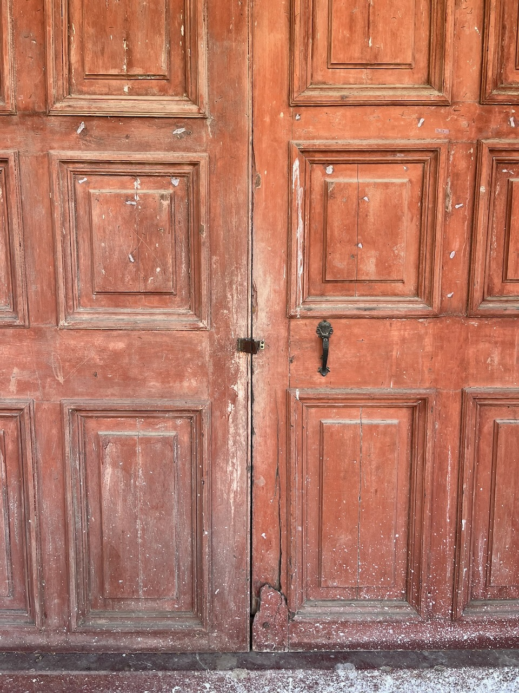{.fotito .lightbox group="Afuera"}
:::

Por la parte lateral de la iglesia habían habitaciones de la parroquia, y una puerta de acceso a la iglesia construida recientemente. No había nadie al rededor y la puerta estaba abierta, así que entré:

::: {.galeria}
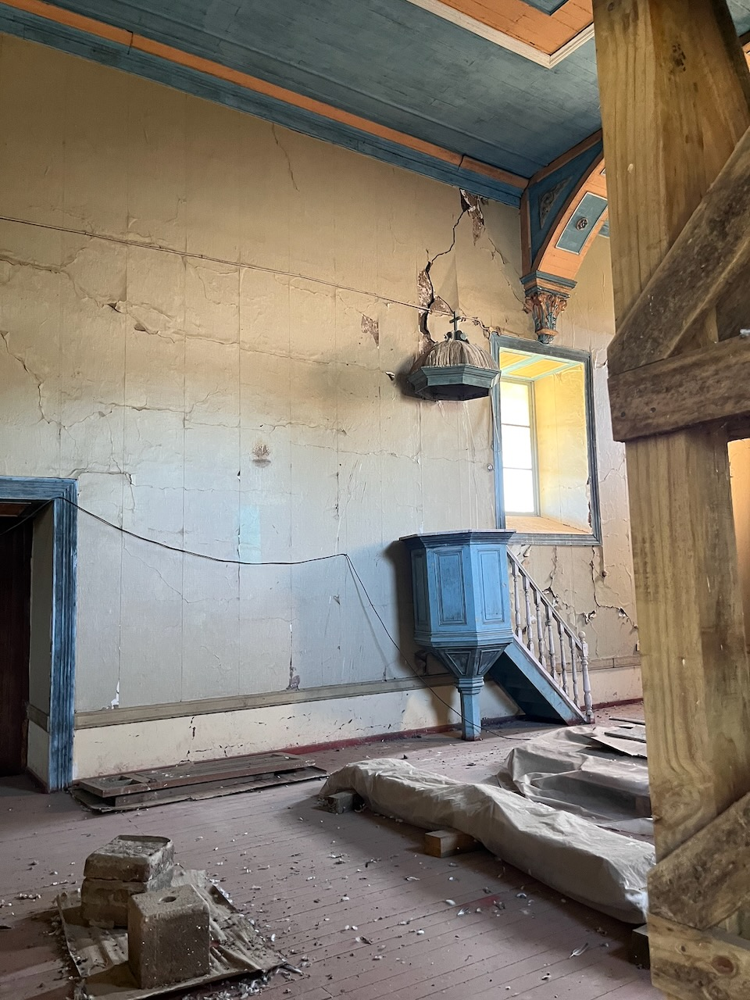{.fotito .lightbox group="Adentro"}
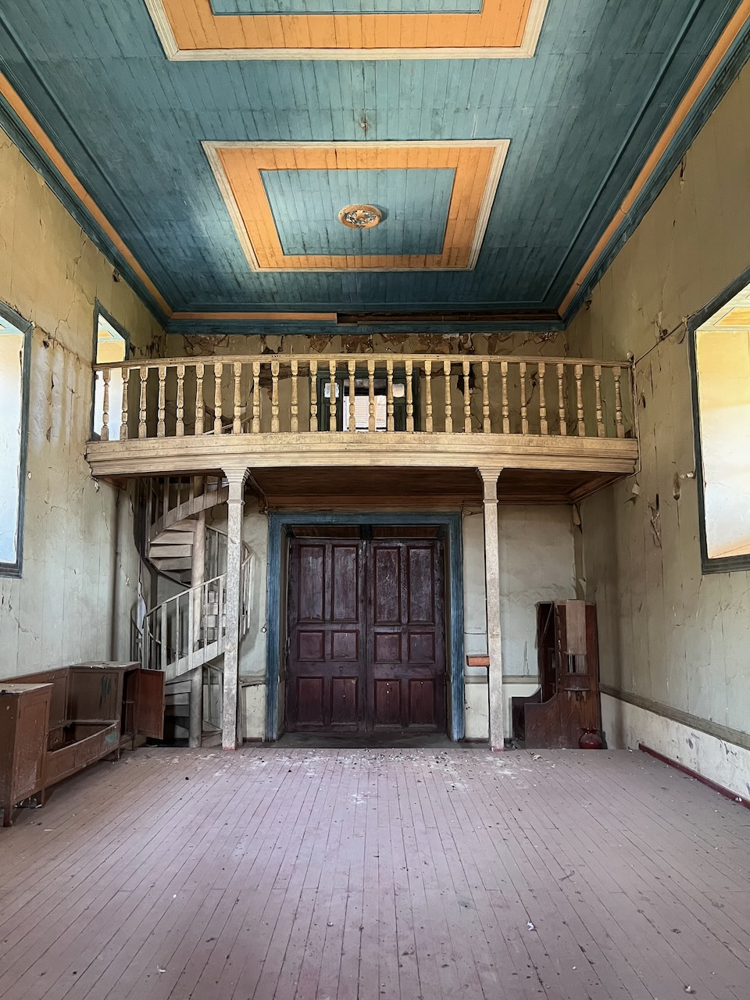{.fotito .lightbox group="Adentro"}
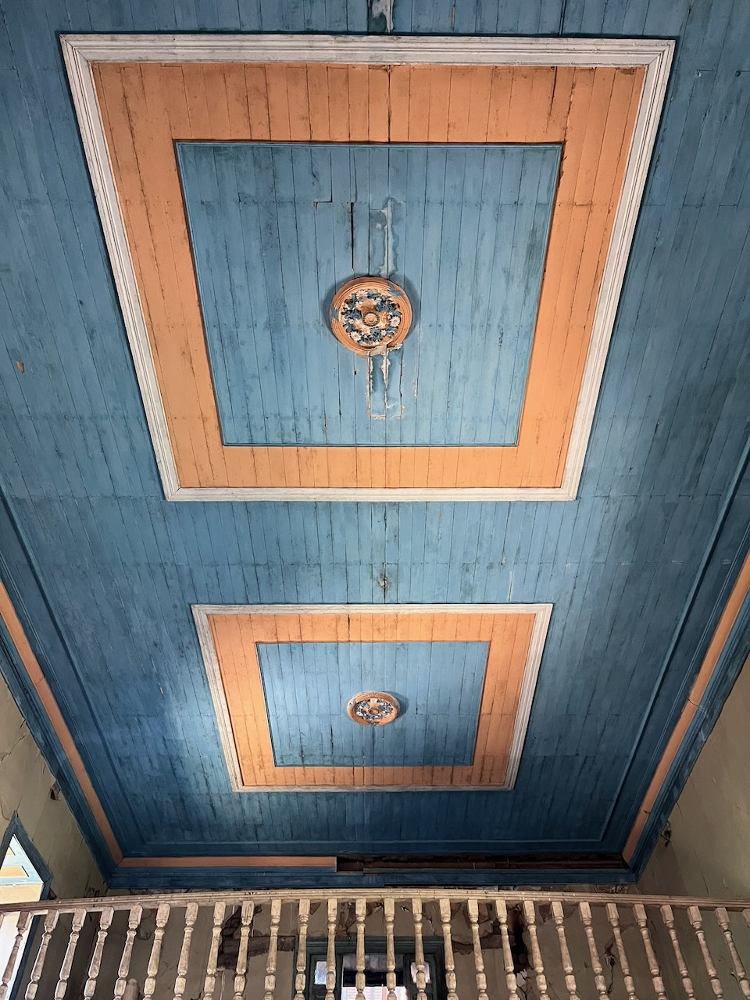{.fotito .lightbox group="Adentro"}
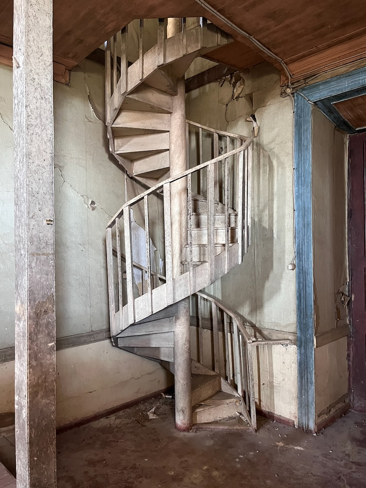{.fotito .lightbox group="Adentro"}
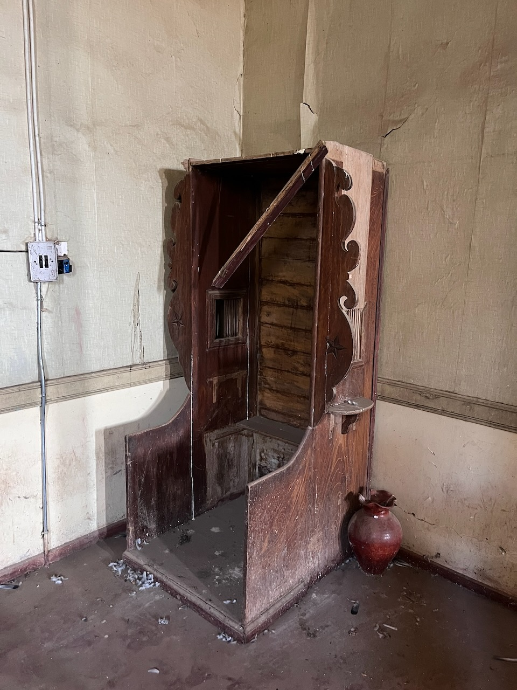{.fotito .lightbox group="Adentro"}
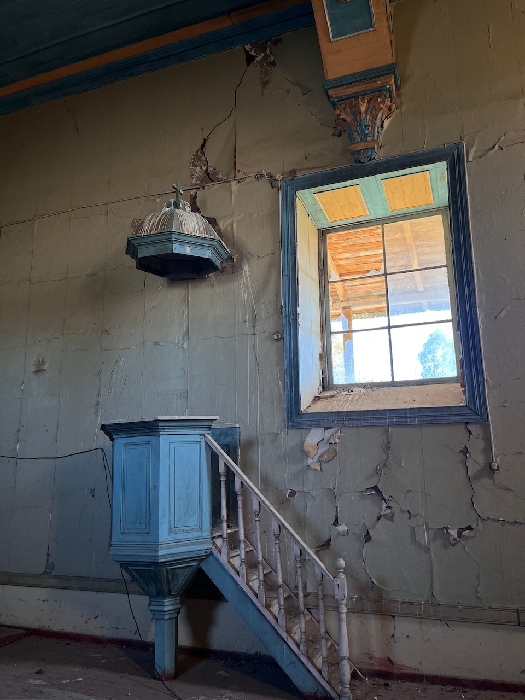{.fotito .lightbox group="Adentro"}
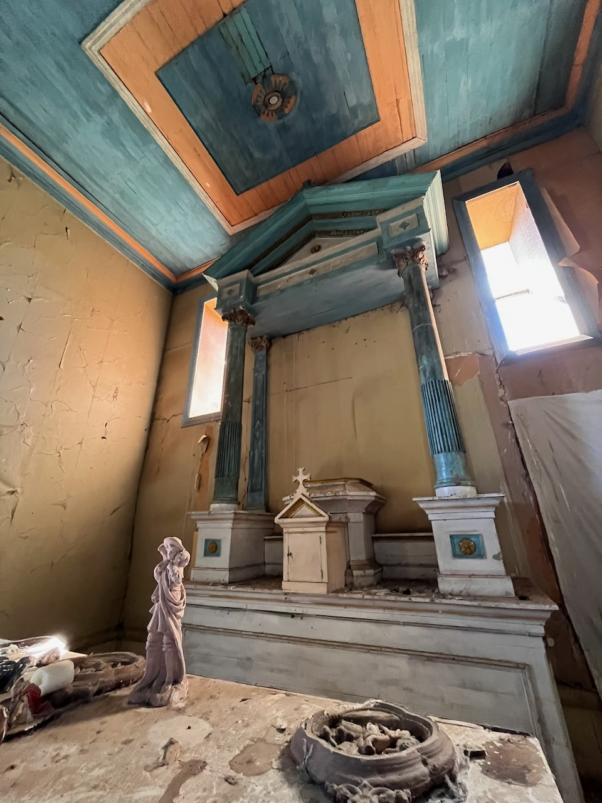{.fotito .lightbox group="Adentro"}
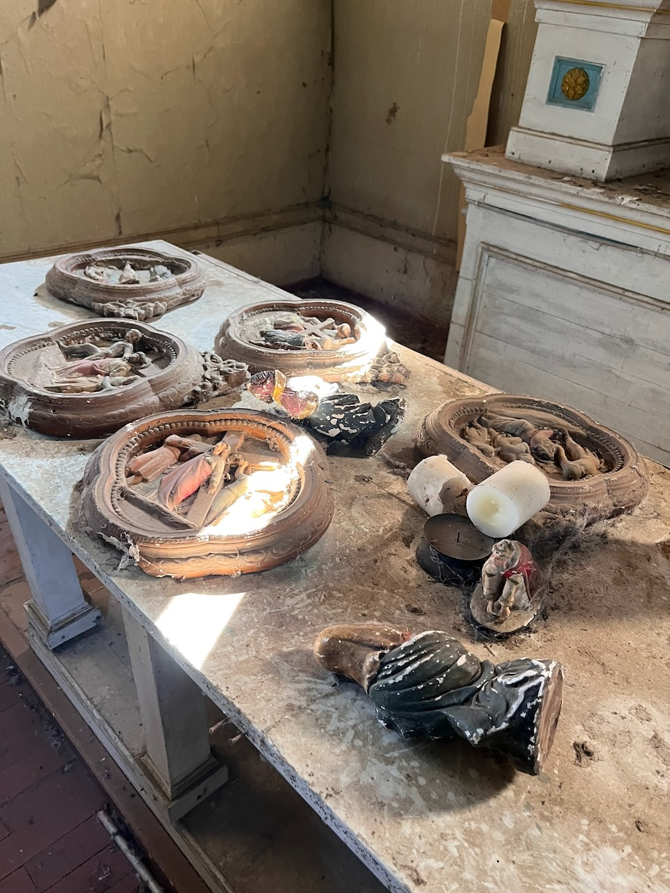{.fotito .lightbox group="Adentro"}
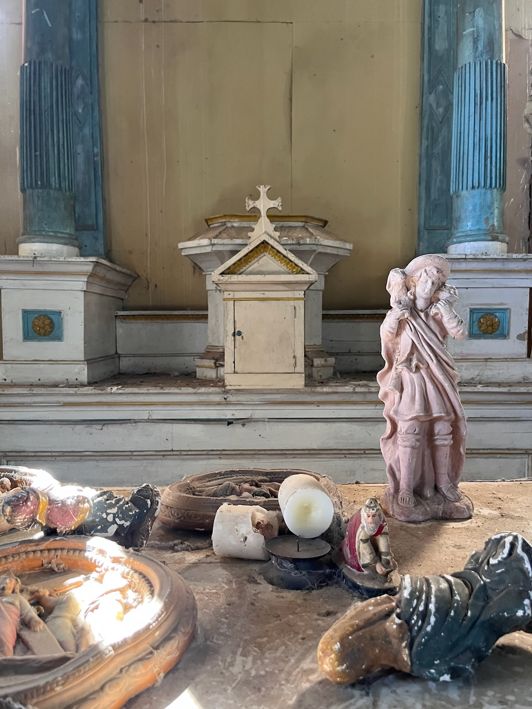{.fotito .lightbox group="Adentro"}
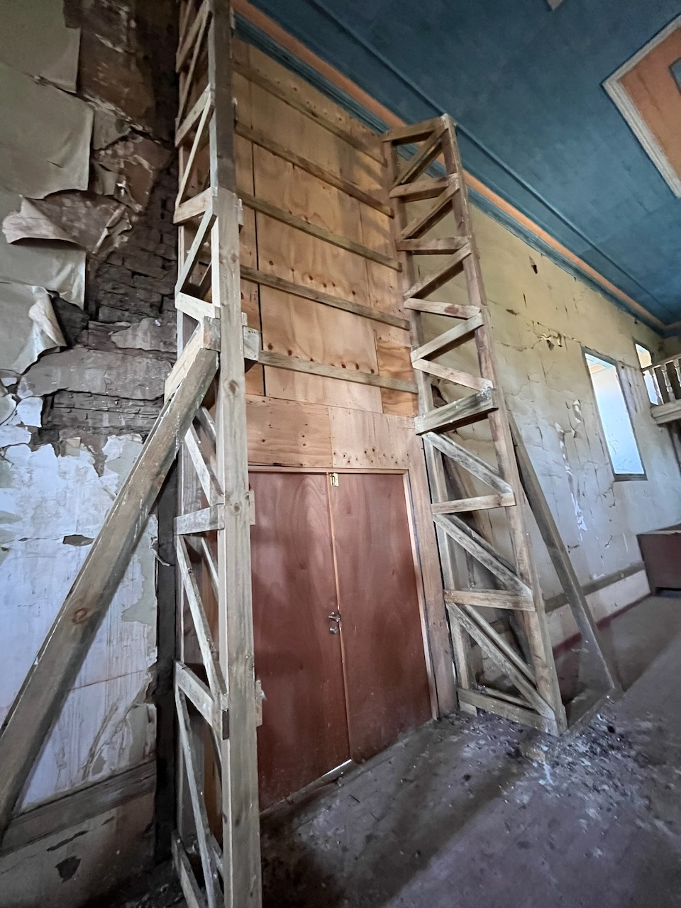{.fotito .lightbox group="Adentro"}
:::

Al entrar volaron muchas palomas que habitaban la parroquia. Por dentro era como una cápsula del tiempo, pero se notaba que han hecho trabajos recientemente. Tenía una escalera de caracol metálica preciosa, pero no quise subir por el mal estado de la estructura.